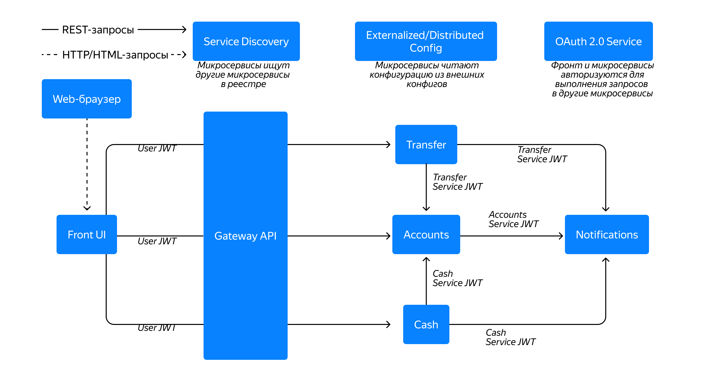

# my-bank-app


[](https://github.com/Aberezhnoy1980/my-bank-app/actions/workflows/ci.yml)

Учебный микросервисный проект банка в рамках **module 3 / sprint 9** (Yandex Practicum).



## Scope

Проект на старте включает:

- Front UI
- Gateway API
- Service Discovery
- Externalized Config
- Accounts, Cash, Transfer, Notifications services

## Stack (baseline)

- Java 21
- Spring Boot, Spring Cloud
- Spring Data JPA + Hibernate
- PostgreSQL (одна БД `mybank`, отдельные **schemas** на сервис с данными: `accounts`, `notifications`), миграции **Liquibase**
- OAuth2 (Authorization Code + Client Credentials)
- Контрактные тесты **Spring Cloud Contract** (producer: `accounts-service`; consumers: `cash-service`, `transfer-service` против stubs)
- Docker / Docker Compose

## Ports (локально по умолчанию)

| Компонент | Порт |
| --------- | ---- |
| Front UI | 8080 |
| Gateway | 8081 |
| Config Server | 8888 |
| Eureka | 8761 |
| Keycloak (optional, `secure`) | 8090 |
| accounts-service | 8091 |
| cash-service | 8092 |
| transfer-service | 8093 |
| notifications-service | 8094 |

## Status

Рабочая ветка: микросервисы, Gateway, OAuth2/Keycloak (профиль `secure`), персистентность Accounts/Notifications, контрактные тесты Cash/Transfer → Accounts.

## Run (local, dev)

Для **`accounts-service`** и **`notifications-service`** нужен доступный PostgreSQL (или контейнер из `docker compose up postgres`). Строка подключения по умолчанию: `jdbc:postgresql://localhost:5432/mybank`, пользователь/пароль `mybank`/`mybank` (как в Compose).

1. Запусти `discovery-server`.
2. Запусти `config-server`.
3. Запусти `gateway`.
4. Запусти `front` и остальные сервисы (`accounts-service`, `cash-service`, `transfer-service`, `notifications-service`).

Проверка инфраструктуры:

- Eureka dashboard: `http://localhost:8761`
- Config Server health: `http://localhost:8888/actuator/health`
- Gateway health: `http://localhost:8081/actuator/health`

## Run (Docker Compose)

```bash
docker compose up --build
```

Полезные команды:

```bash
docker compose ps
docker compose logs -f gateway
docker compose down
```

## Gateway routes

- `/api/accounts/**` -> `accounts-service`
- `/api/cash/**` -> `cash-service`
- `/api/transfers/**` -> `transfer-service`
- `/api/notifications/**` -> `notifications-service`

Фронт открывается по адресу `http://localhost:8080` после запуска нужных сервисов (через Gateway ходят клиенты во все перечисленные API).

## OAuth2 и Keycloak (профиль `secure`)

По умолчанию `app.security.enabled=false`: JWT не проверяется, удобно для CI и локальной отладки без IdP.

Чтобы включить защиту на JWT от Keycloak:

1. Подними Keycloak (образ в `docker-compose.yml`, импорт realm из `docker/keycloak/mybank-realm.json`). Админ-консоль: `http://localhost:8090` (user/password из переменных в compose).
2. Запусти сервисы с профилем **`secure`** и общим issuer, например:

   `KEYCLOAK_ISSUER_URI=http://localhost:8090/realms/mybank`

   Для JVM-сервисов можно передать то же значение через переменную окружения или `-Dspring.profiles.active=secure`.

Клиенты в импорте realm (меняй секреты для своего окружения):

| Client ID | Назначение | Secret (дефолт в YAML) |
| --------- | ---------- | ----------------------- |
| `mybank-front` | браузерный login (`authorization_code`) на Front | `front-secret-change-me` |
| `mybank-services` | `client_credentials` между микросервисами | `services-secret-change-me` |

Пользователи realm для совпадения с демо-данными: `demo.user` / `demo`, `alice.user` / `alice`.

Типичный поток: пользователь логинится через Front → Gateway проверяет JWT → downstream сервисы получают тот же Bearer при вызовах через Gateway; `preferred_username` в токене сопоставляется с username аккаунта (`demo.user`, `alice.user`). При профиле `secure` примеры `curl` ниже требуют заголовок `Authorization: Bearer <access_token>` (удобнее получить токен через UI или напрямую из Keycloak).

**Подробный smoke-тест с профилем `secure`:** пошаговый сценарий, контуры запуска (хост / Docker), получение токена, типичные ошибки (`invalid_grant`, 401 из Front, `RestClient` и LoadBalancer, Keycloak admin vs login приложения) и проверка refresh после нескольких минут — в отдельном документе **[docs/SMOKE_CHECK_SECURE.md](docs/SMOKE_CHECK_SECURE.md)**.

## Smoke check (через Gateway, порт 8081)

Перед проверкой должны быть запущены Eureka, Config Server, Gateway и целевые микросервисы.

Примеры в режиме **без** профиля `secure` (демо-аккаунты по умолчанию включают в том числе `demo.user` и `alice.user`):

```bash
curl -s http://localhost:8081/actuator/health
curl -s http://localhost:8081/api/accounts/me
curl -s -X PUT http://localhost:8081/api/accounts/me \
  -H "Content-Type: application/json" \
  -d '{"fullName":"Demo User","birthDate":"1995-05-20"}'
curl -s -X POST http://localhost:8081/api/cash/deposit \
  -H "Content-Type: application/json" \
  -d '{"amount":100.50}'
curl -s -X POST http://localhost:8081/api/transfers \
  -H "Content-Type: application/json" \
  -d '{"recipientUsername":"alice.user","amount":50.00}'
curl -s -X POST http://localhost:8081/api/notifications \
  -H "Content-Type: application/json" \
  -d '{"eventType":"MANUAL_TEST","message":"hello"}'
```
